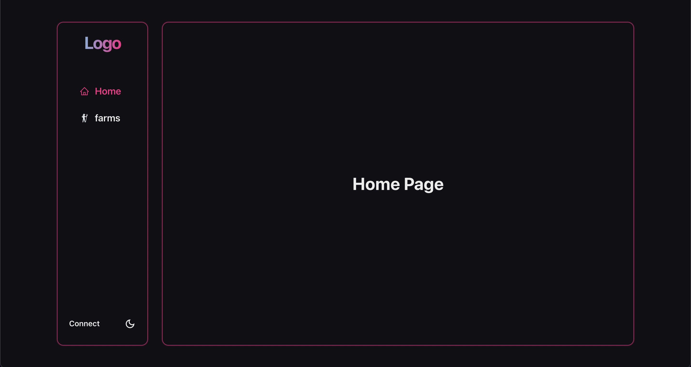
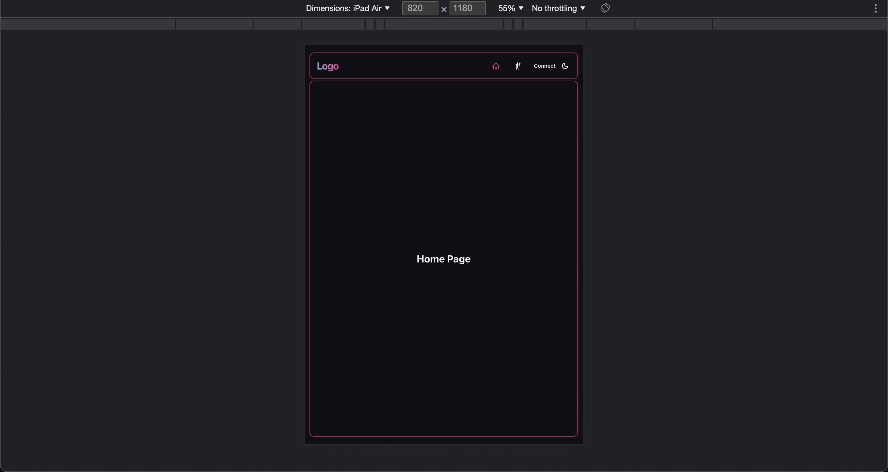
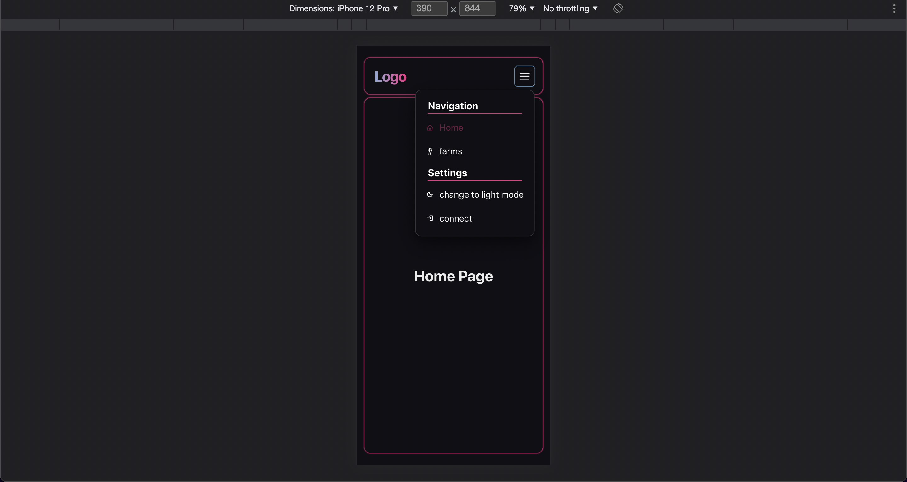

# Eth-dApp-Template-Next

Simple starting template for a dApp frontend built on the Ethereum network using Nextjs and Chakra-ui,
with responsiveness and accessibility in mind.

## Preview

You can view a live preview of the project [here](https://dapp-template-next.vercel.app/)

## Technologies

| name                                                      | version |
| --------------------------------------------------------- | ------- |
| [Nextjs](https://nextjs.org/)                             | ^12.0.7 |
| [typescript](https://www.typescriptlang.org/)             | ^4.5.4  |
| [Chakra-ui](https://chakra-ui.com/)                       | ^1.7.4  |
| [react-icons](https://react-icons.github.io/react-icons/) | ^4.3.1  |
| [ethers](https://docs.ethers.io/v5/)                      | ^5.5.3  |

## Installation

-   Clone normally or with the [degit](https://www.npmjs.com/package/degit) package.
-   Run `yarn` from the root of the project folder to install dependancies.

## Scripts

-   `yarn dev` : runs project in development mode on port 3000.
-   `yarn lint` : runs eslint.
-   `yarn build` : runs next build.

## Screenshots

